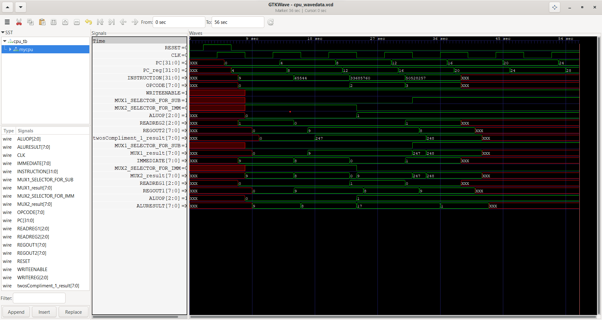

# Develop an 8-bit Single-Cycle CPU with Memory Hierarchy

## Overview

This project involves designing and implementing an 8-bit single-cycle CPU with an associated memory hierarchy. The CPU architecture includes essential components such as an Arithmetic Logic Unit (ALU), register files, control logic, forwarding unit, data memory, data cache, instruction memory, and instruction cache.

## Design and Implementation

- **CPU Architecture**: The CPU is designed using **Verilog-HDL**. It features a single-cycle architecture with a focus on simplicity and instructional purposes.
- **Memory Hierarchy**: The memory subsystem includes separate instruction and data caches to enhance performance by leveraging locality of reference.
- **Simulation**: The behavior of the CPU was simulated using **Icarus Verilog**, and input/output signals were observed using **GTKWave**.
- **Testing**: The CPU was tested using **ARM assembly code** to ensure proper functionality of all instructions and memory operations.
- **Techniques**: Key techniques used include `RISC-V` architecture and `Caching` to manage memory access efficiently.

### CPU Architecture

### Signal Waveforms

## Technologies Used

- **Verilog-HDL**: For designing the CPU and memory hierarchy.
- **ARM Assembly**: For testing the CPU operations.
- **Icarus Verilog**: For simulating the CPU and memory hierarchy.
- **GTKWave**: For visualizing the simulation results.

## Features

- **ALU**: Performs arithmetic and logic operations.
- **Control Logic**: Manages the operation of the CPU, including instruction decoding and execution control.
- **Register Files**: Stores temporary data for the CPU operations.
- **Data and Instruction Caches**: Improves memory access times by storing frequently accessed data and instructions.
